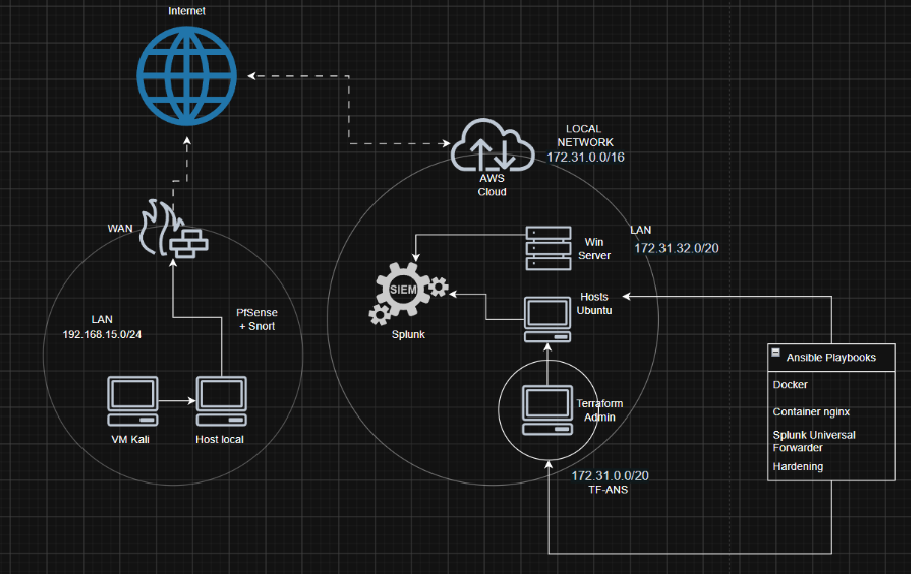

# LEIA-ME

Olá Recrutadores e Gestores!
Fico muito contente que meu perfil profissional pôde chamar sua atenção. Esteja certo que será um prazer contribuir para sua operação de segurança e maturidade da operação.
Este projeto cobre parte do meu portfólio profissional e foi inicialmente proposto como uma atividade para meu curso de pós-graduação e se trata de um pequeno laboratório cuja infraestrutura está demonstrado no diagrama abaixo e no relatório presente nesse repositório.

Nesse projeto, além da documentação do laboratório eu compartilho também os playbooks ansibles/terraform dispostos na pasta de mesmo nome desenvolvidos para a ocasião. Isso foi feito no intuito de demonstrar capacidade técnica para desempenhar bem atividades relacionada a Segurança Defensiva. 